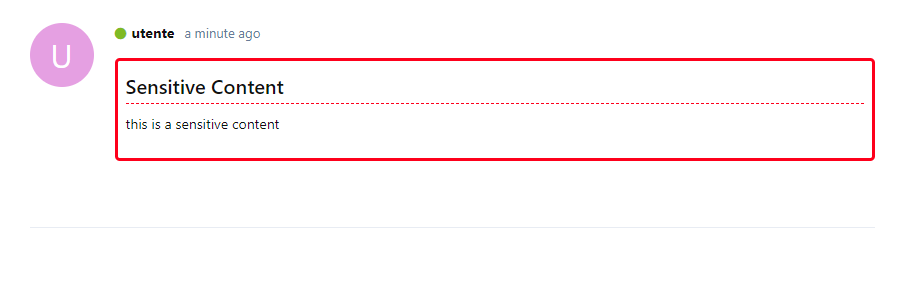

# Sensitive Content

[](https://github.com/Nearata/flarum-ext-sensitive-content/blob/main/UNLICENSE)
[](https://packagist.org/packages/nearata/flarum-ext-sensitive-content)
[](https://github.com/Nearata/flarum-ext-sensitive-content/blob/main/CHANGELOG.md)

> Hide content to non-allowed groups.

## Preview

**NOTE**: only allowed groups can see this element block.

in this example, only admins are allowed to see this



## Install

```sh
composer require nearata/flarum-ext-sensitive-content:"*"
```

## Update

```sh
composer update nearata/flarum-ext-sensitive-content:"*"
php flarum cache:clear
```

## Remove

```sh
composer remove nearata/flarum-ext-sensitive-content
php flarum cache:clear
```

## How to use

```bash
[sensitive-content]this is a sensitive content[/sensitive-content]
```
